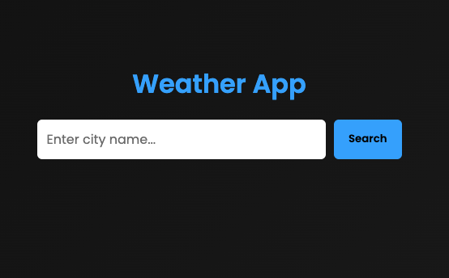

# 🌦 Weather App | Day 3

A modern and responsive Weather App built using **HTML, CSS, and JavaScript** with real-time data from the OpenWeatherMap API.

---

## 🚀 Features
- Search weather by city name  
- Real-time temperature  
- Weather description  
- Dark-themed modern UI  
- Smooth animations  
- Responsive design 

---

## 🛠 Tech Stack
- HTML5  
- CSS3  
- JavaScript (Fetch API)

---

## 📦 How to Use
1. Enter a city name  
2. Click **Search**  
3. View real-time weather info

---

## 📁 Folder Structure
```
│── index.html
│── style.css
│── script.js

```
---

## 📸 Preview



---


## 🌟 About This Project

This is **Day 3** of my journey where I will be building:

### 🔥 15 Frontend Projects in 15 Days

Follow along as I learn and build daily.

---

## 📬 Contact

**Tushar**  
📧 Email: gaudaratushar@gmail.com  
🔗 LinkedIn: www.linkedin.com/in/tushargaudara
🔗 GitHub: https://github.com/tushargaudara

---

## ⭐ Show Your Support

If you like this project, **give it a star ⭐ on GitHub!**  
Your support motivates me to build more projects 🙌